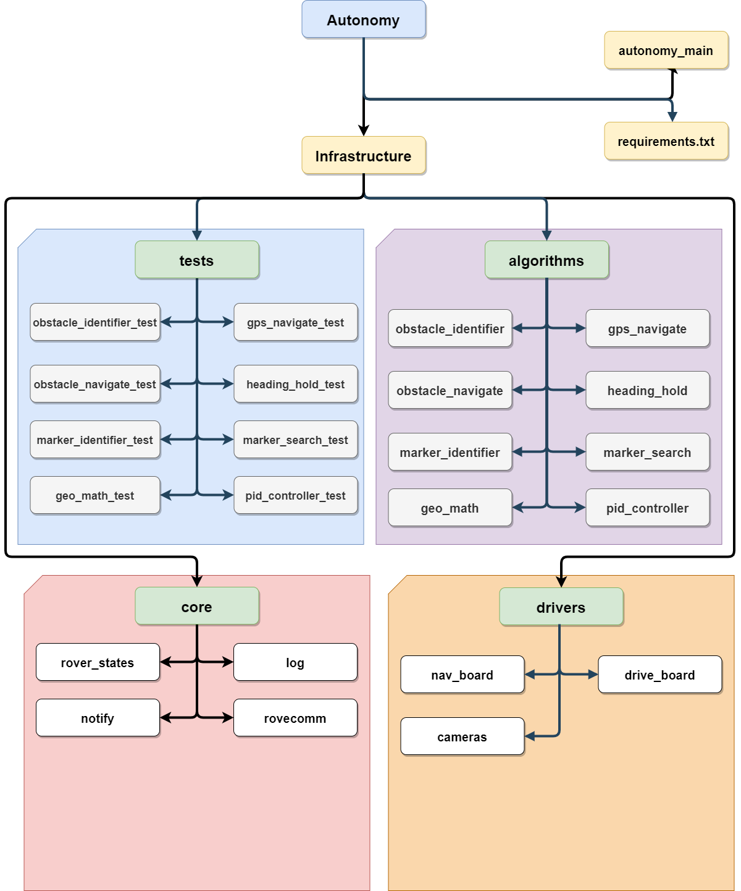

# Autonomy Software

This repo contains the Autonomy software stack for the current iteration of the MRDT Rover designed to compete at the University Rover Challenge. The software is developed to run on a Jetson TX2 development board.

## Architecture
The architecture is broken up into four categories:
1. Core - Contains all the core infrastructure of the Autonomy system, including the state machine, logging and networking with RoveComm.
2. Interfaces - Objects who wrap functionality of various components of the rover.
3. Algorithms - Core pieces of logic that perform the various computational taks that Autonomy requires, such as Haversine math, PID controls and Search pattern.
4. Tests - Broken into two subcategories: Unit and Integration tests. Unit tests are designed to test the basic functionality of any algorithm developed within the Autonomy system. These should be designed to easily test any changes made to an algorithm and should serve as a way to verify if changes broke functionality. Integration tests are designed to test various integration points with hardware accessories and other rover functionality.

